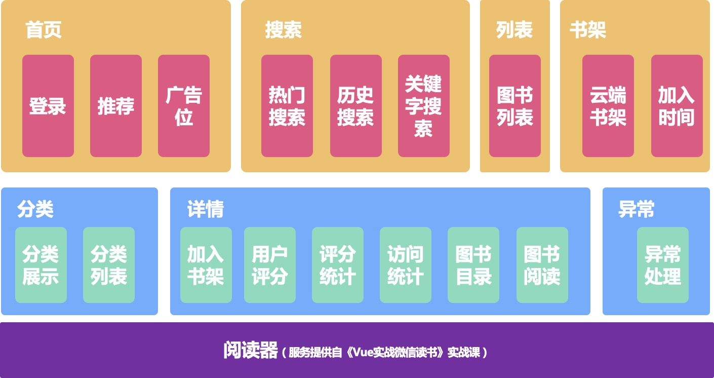

# 技术栈介绍
## mpvue
课程将教会你如何使用脚手架初始化mpvue小程序项目，并完成打包构建，mpvue2.0支持多端小程序，课程将讲解如何实现原生API调用和多端适配，我们还将应用vuex实现全局状态管理和vue-router语法实现路由管理

## 小程序
小程序部分我们将学习原生小程序开发流程，从账号注册、工具下载，一直到上线发布，生成小程序二维码等整个流程，即使你没有任何小程序开发经验也不要紧，课程将从最浅显的知识开始讲起，帮助你顺利破冰小程序！

## 组件库
课程将使用有赞的vant-weapp作为微信小程序的组件库，支付宝小程序则采用官方的mini-antui，我们将介绍如何将组件库集成到mpvue项目，并掌握组件的基本应用方法

## 发布
课程使用git作为代码管理，前后端分离架构，我们将服务端发布到阿里云服务器，并接入https服务，使用nginx作为静态资源服务器

::: tip
课程实际应用的知识点将更加丰富，非常贴近商业项目的需求，详细的课程目录及试听请点击[这里](https://coding.imooc.com/class/chapter/285.html)
:::

# 项目功能结构

# 交互设计

# 前置学习
- 具备一定的javascript、html、css基础
- 了解npm和webpack的基本概念
- 了解node.js的基本概念

# 扫码体验

# 服务号

如果您想学习本课程，请支持正版，谢谢！[购买地址](https://coding.imooc.com/class/285.html)
