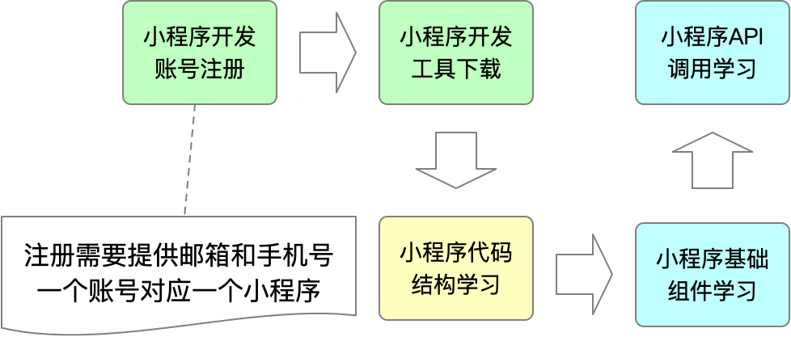
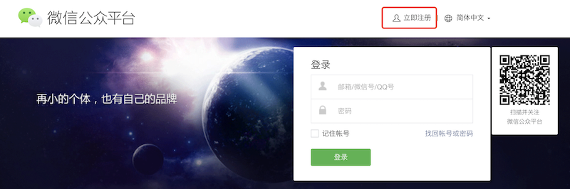
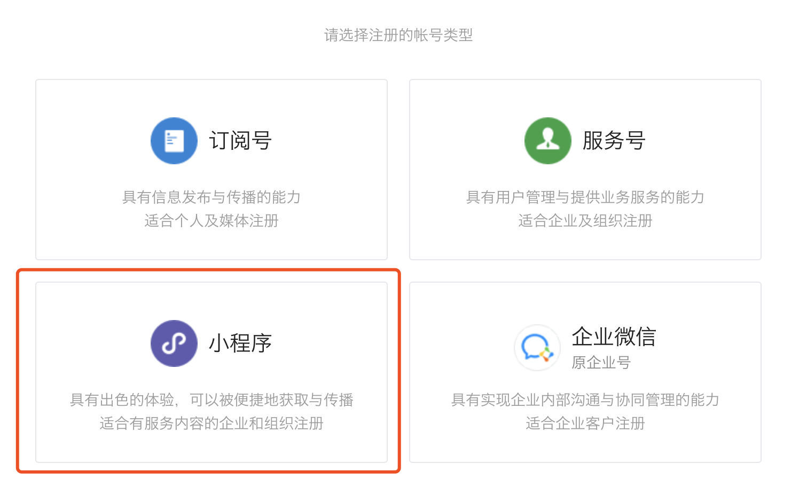
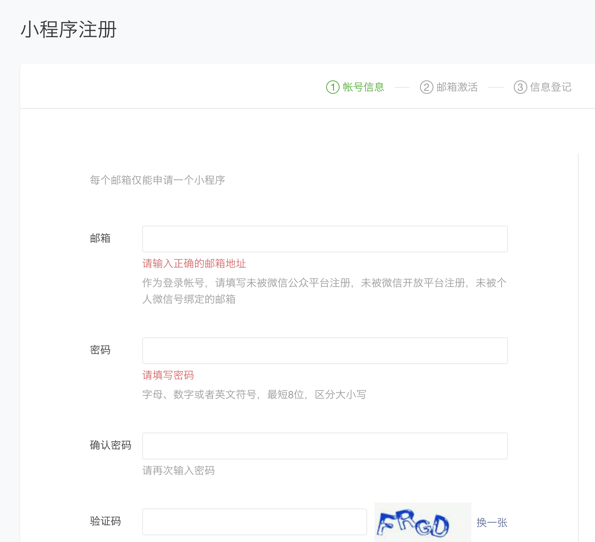
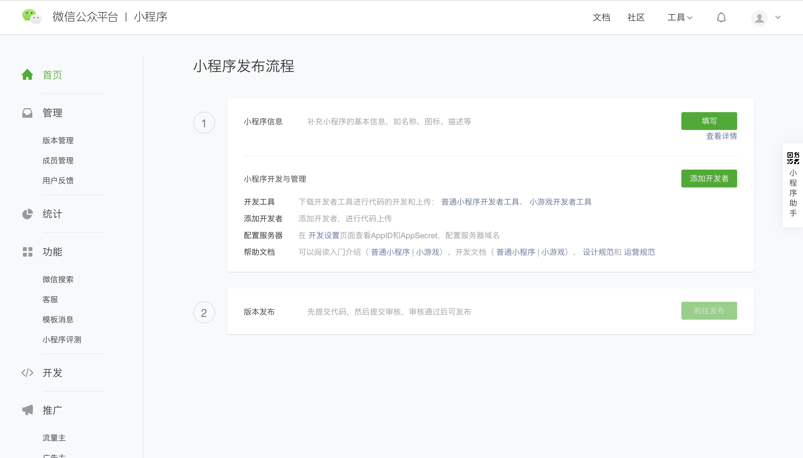
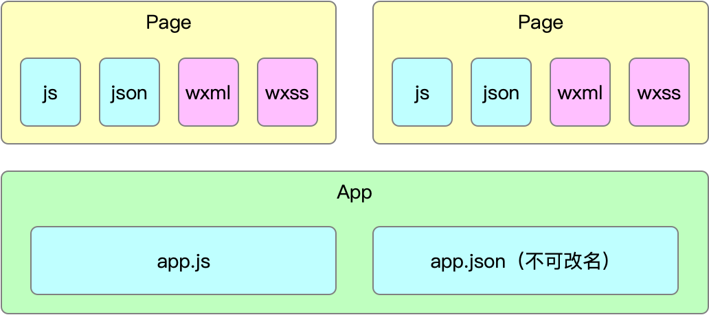
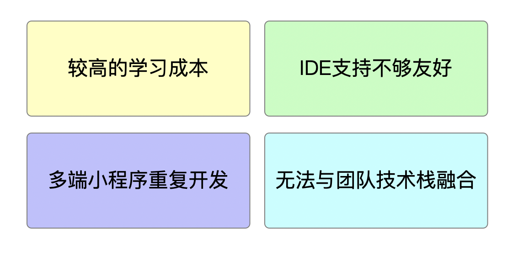

# 微信小程序入门

## 学习流程


## 账号注册
### 访问官网
官网地址：[https://mp.weixin.qq.com](https://mp.weixin.qq.com)

### 点击注册


### 选择小程序


### 注册账号
填写基本信息并完成邮箱激活，完成小程序开发者注册


### 登录
使用刚刚注册的账号登录小程序开发者平台


## 开发工具下载
下载地址：[https://developers.weixin.qq.com/miniprogram/dev/devtools/download.html](https://developers.weixin.qq.com/miniprogram/dev/devtools/download.html)

## 小程序代码结构


## Hello World
### 第一步，创建App
创建app.js
```js
App({})
```

创建app.json
```json
{
  "pages": [
    "test"
  ]
}
```
### 第二步，创建Page
创建test.json
```json
{}
```

创建test.js
```js
Page({
  data: {
    message: 'Hello World!'
  },
  show() {
    wx.showToast({
      title: '小慕读书上线啦！',
    })
  }
})
```

创建test.wxml
```html
<text class="name">{{message}}</text>
<button bindtap="show">点我</button>
```

创建test.wxss
```css
.name {
  color: red;
}
```

通过以上步骤我们创建了一个简单的小程序应用，通过这个案例我们学到如下知识点：
- 小程序本质是一个渲染容器，可以把它想象成浏览器
- 小程序由App和Page两部分构成
- App需要依赖2个文件：app.js和app.json，其中app.json不可改名，且必须配置pages属性
- Page需要依赖4个文件：js、json、wxml和wxss

## 基础组件使用方法
[https://developers.weixin.qq.com/miniprogram/dev/component/](https://developers.weixin.qq.com/miniprogram/dev/component/)

## API调用方法
[https://developers.weixin.qq.com/miniprogram/dev/api/](https://developers.weixin.qq.com/miniprogram/dev/api/)

## 原生小程序的缺点

