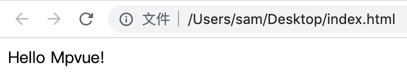
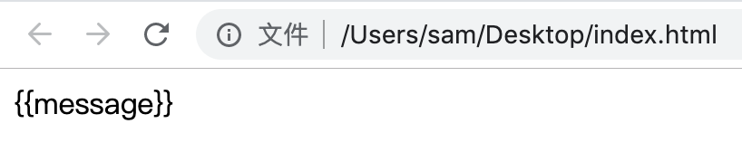

# Vue入门

## 为什么要学习Vue
先看一组数据
- github star 14w+，位列开发项目第一
- [patreon](https://www.patreon.com/evanyou)捐赠$1.5w+/月
- Chrome DevTools周活用户90w+

给出三点理由：
- 最热门的前端开源框架之一
- 大幅提升Web开发效率，降低开发门槛
- 大幅提升Web项目的可维护性

## Hello World
### 第一步 在桌面创建index.html文件
```bash
touch ~/Desktop/index.html
```

### 第二步 填入如下代码
用你喜欢的编辑器打开这个文件（注意：不要用浏览器打开，因为这样你无法编辑它），推荐使用Webstorm或者Vscode，写入如下代码：
```html
<!DOCTYPE html>
<html>
  <head>
    <title>vue测试</title>
    <script src="https://cdn.jsdelivr.net/npm/vue/dist/vue.js"></script>
  </head>
  <body>
    <div id="root">{{message}}</div>
    <script>
      new Vue({
        el: '#root',
        data() {
          return {
            message: 'Hello Mpvue!'
          }
        }
      })
    </script>
  </body>
</html>
```

### 第三步 使用浏览器打开index.html
这时我们会在浏览器中看到如下效果：

如果你也看到同样的内容，恭喜你！这说明我们的程序生效了

## 源码分析
上述代码基本是Vue可运行的最小case，下面我们就来分析一下这个case的具体执行过程，帮忙大家理解Vue的工作原理（为了节约篇幅，省略了与Vue无关的内容）：
### 第一步，加载vue.js脚本
```html
<script src="https://cdn.jsdelivr.net/npm/vue/dist/vue.js"></script>
```
执行这行代码时，浏览器会下载并执行vue.js这个脚本文件，下载地址是：[https://cdn.jsdelivr.net/npm/vue/dist/vue.js](https://cdn.jsdelivr.net/npm/vue/dist/vue.js)，大家可以直接打开这个文件，这个文件就是Vue.js源码经过编译、打包后生成的最终文件

::: warning
这里有两个非常重要的基础知识点：
- 浏览器解析html文件的过程是自上而下、逐行解析的
- 执行script标签时，浏览器会下载，然后执行js脚本，只有这一步完成后才会开始下一步，因为如果不完成这一步，下面的代码中如果使用了该js脚本内容时就会报错
:::

### 第二步，生成div
加载完vue.js脚本后浏览器继续执行body中的内容
```html
<div id="root">{{message}}</div>
```
当浏览器执行到上述代码时，得到的效果如下：

为什么会这样呢？因为这里的<span v-pre>`{{message}}`</span>被视为普通文本来执行了，要验证这一点很简单，大家把代码中`<script>...</script>`这部分代码删除即可

### 第三步，执行script脚本
我们通过结果可以反推下面这段代码的作用是将界面中的<span v-pre>`{{message}}`</span>替换为`Hello Mpvue!`，事实也确实如此！这里的`el: '#root'`告诉浏览器去查找id为root的DOM，然后将其中的变量替换为我们自定义的内容
```js
new Vue({
  el: '#root',
  data() {
    return {
      message: 'Hello Mpvue!'
    }
  }
})
```

到这里，我要恭喜你，已经完成了Vue.js的入门学习，由此可见Vue.js并没有那么难学！

## 事件

下面我们向界面中增加一个按钮，代码如下：
```html
<div id="root">
  {{message}}
  <button>点击变换文字</button>
</div>
```

这时虽然可以看到按钮，但是点击它是没有反应的，因为我们还没有绑定事件，Vue中绑定点击事件需要通过`@click`来实现：
```html
<div id="root">
  {{message}}
  <button @click="handleClick">点击变换文字</button>
</div>
```
::: warning
这里有一点非常重要，就是button必须为位于id为root的div下，vue只会处理该div下的DOM，像下面这样的代码是无法绑定成功的！
:::
```html
<div id="root">{{message}}</div>
<!-- 下面这行代码绑定事件是无效的 -->
<button @click="handleClick">点击变换文字</button>
```

这段代码表示点击按钮时，会调用`handleClick`方法，注意这个方法是需要定义在Vue参数的methods属性中，完整代码如下：
```html
<!DOCTYPE html>
<html>
  <head>
    <title>vue测试</title>
    <script src="https://cdn.jsdelivr.net/npm/vue/dist/vue.js"></script>
  </head>
  <body>
    <div id="root">
      {{message}}
      <button @click="handleClick">点击变换文字</button>
    </div>
    <script>
      new Vue({
        el: '#root',
        data() {
          return {
            message: 'Hello Mpvue!'
          }
        },
        methods: {
          handleClick() {
            this.message = 'Click worked!'
          }
        }
      })
    </script>
  </body>
</html>
```
回到浏览器中点击按钮，可以看到文字从`Hello Mpvue!`变成了`Click worked!`

## 条件

下面我们略微修改需求，我们希望点击按钮时，文字隐藏，如果文字已经处于隐藏状态，则进行显示，要实现这一点，我们需要借助`v-if`或`v-show`指令，先改造DOM：
```html
<div id="root">
  <span v-if="visible">{{message}}</span>
  <button @click="handleClick">点击隐藏文字</button>
</div>
```
上述代码表示，当`visible`变量为`true`时，显示`span`标签，反之则隐藏，下面我们再定义`visible`变量，并且修改事件：
```html
<!DOCTYPE html>
<html>
  <head>
    <title>vue测试</title>
    <script src="https://cdn.jsdelivr.net/npm/vue/dist/vue.js"></script>
  </head>
  <body>
    <div id="root">
      <span v-if="visible">{{message}}</span>
      <button @click="handleClick">点击隐藏文字</button>
    </div>
    <script>
      new Vue({
        el: '#root',
        data() {
          return {
            message: 'Hello Mpvue!',
            visible: true
          }
        },
        methods: {
          handleClick() {
            this.visible = !this.visible
          }
        }
      })
    </script>
  </body>
</html>
```

这里我们具体做了两件事：
- 定义了`visible`变量，默认为`true`，那么`span`默认就是显示状态
- 修改了`handleClick`，当点击按钮时对`visible`取反，也就是说显示的时候隐藏，隐藏的时候显示

::: tip
这里我们可以将v-if改为v-show，他们两者的区别在于v-if隐藏时会移除DOM，而v-show隐藏时仅仅改变DOM的display属性为none
:::

## 循环

下面我们继续增加需求的复杂度，我们希望点击一次按钮，就会再出现一行文字，这时字符串已经不能满足我们的需求了，我们需要创建一个数组来存储数据，然后通过`v-for`循环指令来进行显示，还是先修改DOM：

```html
<div id="root">
  <div v-for="item in data" :key="item">{{message}} - {{item}}</div>
  <button @click="handleClick">点击添加一行</button>
</div>
```

`v-for`使用时需要有两个注意点：
1. `data`必须是一个数组或者对象，即可遍历的元素
2. 使用`v-for`的DOM需要指定`key`属性，并且绑定到一个唯一值

接下来的工作是定义`data`变量，修改`handleClick`方法：
```html
<!DOCTYPE html>
<html>
  <head>
    <title>vue测试</title>
    <script src="https://cdn.jsdelivr.net/npm/vue/dist/vue.js"></script>
  </head>
  <body>
    <div id="root">
      <div v-for="item in data" :key="item">{{message}} - {{item}}</div>
      <button @click="handleClick">点击添加一行</button>
    </div>
    <script>
      new Vue({
        el: '#root',
        data() {
          return {
            message: 'Hello Mpvue!',
            data: [],
            index: 1,
          }
        },
        methods: {
          handleClick() {
            this.data.push(this.index++)
          }
        }
      })
    </script>
  </body>
</html>
```

初始状态下，我们可以看到界面上只有一个按钮，当点击按钮时会添加一行，再次点击会再增加一行，这是因为每次点击时我们都会往`data`中添加一个元素`index`，然后将`index`的值加1，这样每点击第一次`data`中就多一个元素，从而实现了列表展示

## 双向绑定

下面我们将展示Vue的双向绑定机制，我们先在界面中添加一个`input`输入框，并使用`v-model`绑定一个变量：
```html
<div id="root">
  <input type="text" v-model="data">
  <div>{{data}}</div>
</div>
```

完整源码如下：
```html
<!DOCTYPE html>
<html>
  <head>
    <title>vue测试</title>
    <script src="https://cdn.jsdelivr.net/npm/vue/dist/vue.js"></script>
  </head>
  <body>
    <div id="root">
      <input type="text" v-model="data">
      <div>{{data}}</div>
    </div>
    <script>
      new Vue({
        el: '#root',
        data() {
          return {
            data: null,
          }
        }
      })
    </script>
  </body>
</html>
```

在浏览器中打开文件检查效果：我们向`input`输入框中输入一些文本，发现下方的`div`中的内容会随着改变，这说明`Vue`帮我们做了以下工作：
1. 监听`input`的输入变化
2. 将`input`的输入变化写入`data`变量

## 组件化

数据驱动和组件化是`Vue`最重要的两个概念，上面的概念都在演示如何通过数据的方式驱动`DOM`的变化，下面我们将演示如何通过组件化的方式简化开发，提高复用，我们先创建一个`Message`组件：
```js
Vue.component('Message', {
  template: '<div>{{data}}</div>',
  props: {
    data: String
  }
})
```

创建组件需要通过`Vue.component`这个静态方法来实现，第一个参数是组件的名称，第二个参数是组件的参数：
- `template`: 表示组件对应的`DOM`结构
- `props`: 父组件传入的参数名称和值类型

完整源码如下：
```html
<!DOCTYPE html>
<html>
  <head>
    <title>vue测试</title>
    <script src="https://cdn.jsdelivr.net/npm/vue/dist/vue.js"></script>
  </head>
  <body>
    <div id="root">
      <Message :data="message"></Message>
    </div>
    <script>
      Vue.component('Message', {
        template: '<div>{{data}}</div>',
        props: {
          data: String
        }
      })
      new Vue({
        el: '#root',
        data() {
          return {
            message: 'Hello Mpvue!'
          }
        }
      })
    </script>
  </body>
</html>
```

这段代码虽然很短，但是逻辑还是比较复杂的，下面具体给大家解析执行过程：
1. 定义组件`Message`，并且指定了组件的`template`和`props`
2. 实例化`Vue`对象，初始化了`message`
3. `DOM`中使用了`Message`组件，此时会将该组件替换为`template`中的内容，并接收父组件传入的`data`参数，这里`data`参数的值为`message`
4. 完成对DOM的渲染

组件是可以嵌套的，也就是说组件中可以继续嵌套组件，从而实现更高层次的复用！

## 脚手架的使用
1. 安装cnpm
官网：http://npm.taobao.org/
```bash
npm install -g cnpm --registry=https://registry.npm.taobao.org
```

2. 安装vue
Vue-CLI官网：[https://cli.vuejs.org/zh/](https://cli.vuejs.org/zh/)
```bash
cnpm install -g @vue/cli
```
3. 项目初始化
```bash
vue create hello-world
```

4. 运行项目
```bash
cd hello-world
npm run serve
```

5. 代码结构
- index.html：应用的入口文件
- main.js：主js文件，初次渲染时执行
- App.vue：根组件，在main.js中加载

## 小结
至此，Vue的基础部分就给大家讲解完了，如果大家还有什么不清楚的地方可以到问答区与我互动哦
