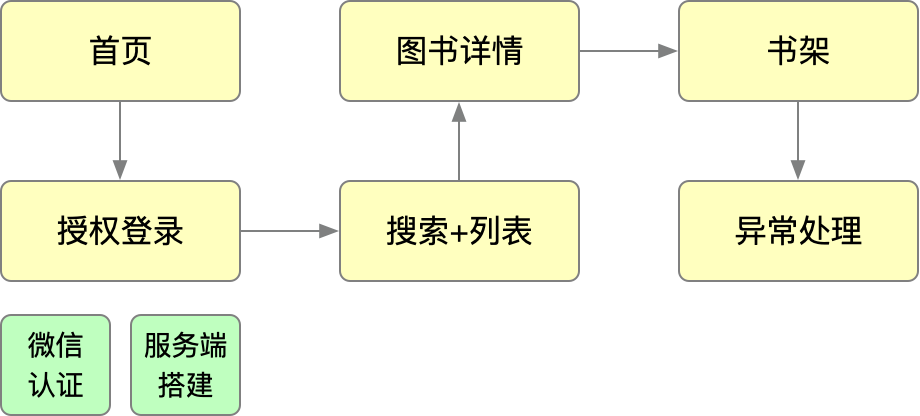

# 项目开发指南

## 项目需求分析
### 首页
- 授权登录
- 预加载骨架图
- 搜索框（热门搜索词）
- 书架精选图书
- banner图
- 推荐图书列表
- 分类列表（部分）

### 搜索
- 热门搜索
- 历史搜索
- 搜索列表
- 换一批
- 清空搜索
- 快捷搜索（直接搜索热门词）
- 底部自动刷新

### 图书列表
- 图片懒加载
- 图书列表展示

### 分类列表
- 全部分类展示

### 图书详情
- 详情骨架图
- 图书信息
- 图书目录
- 评分
- 已读信息
- 加入/移出书架
- 阅读

### 书架
- 加入时间
- 书架列表

### 异常
- 小程序异常捕获
- Vue异常捕获
- 异常信息展示

## 交互视觉
### Sketch下载
- 官网：[https://www.sketch.com/](https://www.sketch.com/)
- oursketch下载：[https://www.oursketch.com/tool/sketch](https://www.oursketch.com/tool/sketch)

### measure插件
下载地址：[http://www.youbaobao.xyz/mpvue-design/measure.zip](http://www.youbaobao.xyz/mpvue-design/measure.zip)

### 交互稿

### 视觉稿
[http://www.youbaobao.xyz/mpvue-design/preview](http://www.youbaobao.xyz/mpvue-design/preview)

## 开发计划

