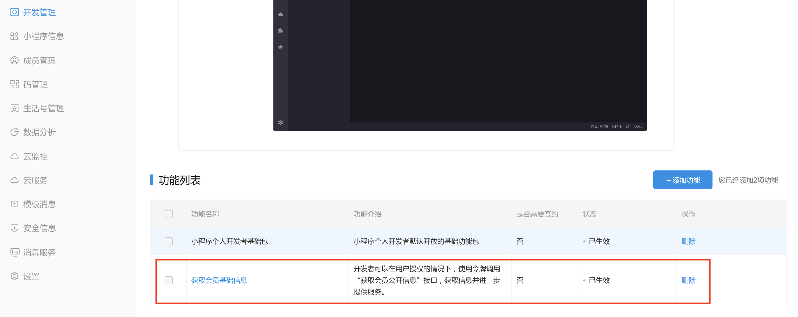

# 支付宝小程序开发指南

## 开发者工具下载

[点击](https://docs.alipay.com/mini/ide/download)下载

## 获取openId

### 生成公钥和私钥

开发 `openId` 获取接口需要生成公钥和私钥，[查看](https://docs.open.alipay.com/291/105971#LDsXr)技术文档

### 填入公钥信息

进入小程序开发者后台，在设置->开发设置->开发信息下填入公钥

### 服务端 SDK

支付宝小程序获取 `openId` 需要通过服务端 `SDK` 开发进行支持，[查看](https://docs.open.alipay.com/54/103419/)开发文档地址

### Node.js 版本开发

首先需要安装依赖：
```bash
npm install alipay-sdk
```

下面提供核心代码：
```js
const AlipaySdk = require('alipay-sdk').default
app.get('/openId/get/alipay', (req, res) => {
  const appId = req.query.appId
  const code = req.query.code
  if (!appId || !code) {
    onFail(res, '获取openId失败')
  } else {
    const alipaySdk = new AlipaySdk({
      appId,
      privateKey: fs.readFileSync(appIdMap[appId], 'ascii')
    })
    alipaySdk.exec('alipay.system.oauth.token', {
      grantType: 'authorization_code',
      code,
      refreshToken: 'token'
    }).then(result => {
      console.log('alipay', result)
      if (result) {
        const { alipayUserId, userId, accessToken } = result
        onSuccess(res, '获取openId成功', {
          openid: `${userId}|${alipayUserId}`,
          session_key: accessToken
        })
      } else {
        onFail(res, '获取openId失败')
      }
    }).catch(err => {
      onFail(res, '获取openId失败', err)
    })
  }
})
```

这里有两点需要注意：
- `appIdMap[appId]` 为私钥地址
- 将 `userId|alipayUserId` 定义为 `openId`，因为支付宝中没有 `openId` 的概念

## 获取用户信息

需要手动添加权限，[查看](https://docs.alipay.com/mini/introduce/twn8vq)开发文档地址



## 用户授权

```html
<button
  class="auth-btn"
  plain="true"
  open-type="getAuthorize"
  scope='userInfo'
>
  授权登录
</button>
```

支付宝小程序中仍然是通过 `open-type` 和 `scope` 完成授权

## API 改造

API 获取方式需要进行兼容：
```js
export function getUserInfo(onSuccess, onFail) {
  const wx = () => {
    mpvue.getUserInfo({
      success(res) {
        const { userInfo } = res
        console.log('getUserInfo', userInfo)
        onSuccess(userInfo)
      },
      fail() {
        onFail ? onFail() : setError('获取用户信息失败')
      }
    })
  }
  const my = () => {
    mpvue.getAuthUserInfo({
      success(res) {
        console.log(res)
        res.avatarUrl = res.avatar || res.avatarUrl
        delete res.avatar
        console.log('getOpenUserInfo', res)
        onSuccess(res)
      },
      fail() {
        onFail ? onFail() : setError('获取用户信息失败')
      }
    })
  }
  adapter({ wx, my })
}
``` 

`adapter` 方法源码：
```js
function adapter(fn, params) {
  return fn[mpvuePlatform] && fn[mpvuePlatform](params)
}
```
