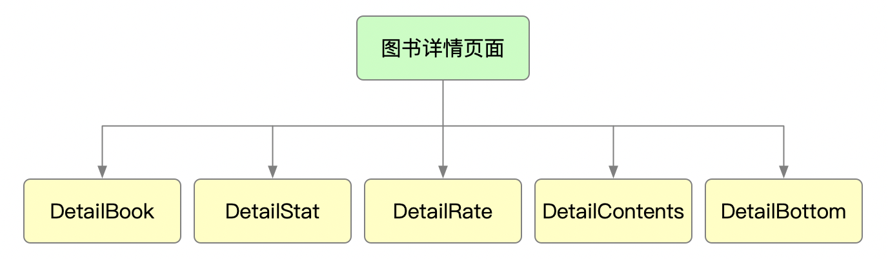
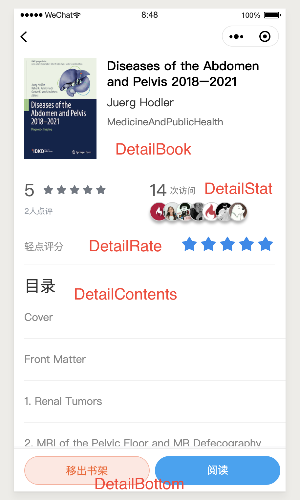

# 图书详情

## 学习重点

- `van-rate` 组件的使用（查看[官方文档](https://youzan.github.io/vant-weapp/#/rate)）
- API对接：
    - 图书详情API
    - 评分API
    - 目录API
    - 加入书架API
    - 移出书架API
- 微信小程序API：
    - `showModal` 确认对话框

## 图书详情视觉稿
[http://www.youbaobao.xyz/mpvue-design/preview/#artboard9](http://www.youbaobao.xyz/mpvue-design/preview/#artboard9)

## 搜索页面组件结构图



## 搜索页面组件示意图



## 图书信息组件
图书详情中的图书信息组件

<table>
    <tr>
        <th>组件名称</th>
        <th>属性</th>
        <th>参数</th>
        <th>用途</th>
        <th>默认值</th>
    </tr>
    <tr>
        <td>DetailBook</td>
        <td>props</td>
        <td>book</td>
        <td>图书信息</td>
        <td>{}</td>
    </tr>
</table>

## 图书统计组件

显示图书的统计信息

<table>
    <tr>
        <th>组件名称</th>
        <th>属性</th>
        <th>参数</th>
        <th>用途</th>
        <th>默认值</th>
    </tr>
    <tr>
        <td rowspan="4">DetailStat</td>
        <td rowspan="4">props</td>
        <td>readers</td>
        <td>读者信息</td>
        <td>[]</td>
    </tr>
    <tr>
        <td>readerNum</td>
        <td>阅读人数</td>
        <td>0</td>
    </tr>
    <tr>
        <td>rankNum</td>
        <td>评分人数</td>
        <td>0</td>
    </tr>
    <tr>
        <td>rankAvg</td>
        <td>平均得分</td>
        <td>0</td>
    </tr>
</table>

## 图书评分组件

图书评分组件

<table>
    <tr>
        <th>组件名称</th>
        <th>属性</th>
        <th>参数</th>
        <th>用途</th>
        <th>默认值</th>
    </tr>
    <tr>
        <td rowspan="2">DetailRate</td>
        <td>props</td>
        <td>rateValue</td>
        <td>上次评分</td>
        <td>0</td>
    </tr>
    <tr>
        <td>methods</td>
        <td>onRateChange</td>
        <td>评分更改时触发事件</td>
        <td>(空)</td>
    </tr>
</table>

## 图书目录组件

显示图书目录

<table>
    <tr>
        <th>组件名称</th>
        <th>属性</th>
        <th>参数</th>
        <th>用途</th>
        <th>默认值</th>
    </tr>
    <tr>
        <td rowspan="2">DetailContents</td>
        <td>props</td>
        <td>contents</td>
        <td>图书目录信息</td>
        <td>[]</td>
    </tr>
    <tr>
        <td>methods</td>
        <td>readBook</td>
        <td>阅读电子书</td>
        <td>(空)</td>
    </tr>
</table>

## 图书详情页脚组件

图书详情页脚组件

<table>
    <tr>
        <th>组件名称</th>
        <th>属性</th>
        <th>参数</th>
        <th>用途</th>
        <th>默认值</th>
    </tr>
    <tr>
        <td rowspan="3">DetailBottom</td>
        <td>props</td>
        <td>isInShelf</td>
        <td>是否在书架中</td>
        <td>[]</td>
    </tr>
    <tr>
        <td rowspan="2">methods</td>
        <td>handleShelf</td>
        <td>修改书架状态</td>
        <td>(空)</td>
    </tr>
    <tr>
        <td>readBook</td>
        <td>阅读电子书</td>
        <td>(空)</td>
    </tr>
</table>


## 组件源码

### DetailBook

```vue
<template>
  <div class="detail-info">
    <div class="detail-info-l">
      <div class="book-img">
        <ImageView :src="book && book.cover"></ImageView>
      </div>
    </div>
    <div class="detail-info-r">
      <div class="book-title">{{(book && book.title) || ''}}</div>
      <div class="book-author">{{(book && book.author) || ''}}</div>
      <div class="book-category">{{(book && book.categoryText) || ''}}</div>
    </div>
  </div>
</template>

<script>
  import ImageView from '../base/ImageView'
  export default {
    components: { ImageView },
    props: {
      book: Object
    }
  }
</script>

<style lang="scss" scoped>
  .detail-info {
    display: flex;
    padding: 10px 15px;

    .detail-info-l {
      padding-right: 15px;

      .book-img {
        width: 100px;
      }
    }

    .detail-info-r {
      flex: 1;
      overflow: hidden;

      .book-title {
        font-size: 18px;
        line-height: 22px;
        max-height: 66px;
        font-weight: 500;
        overflow: hidden;
        color: #000;
        text-overflow: clip;
      }

      .book-author {
        margin-top: 10px;
        font-size: 16px;
        line-height: 18px;
        max-height: 36px;
        overflow: hidden;
        color: #333;
        text-overflow: clip;
      }

      .book-category {
        margin-top: 10px;
        font-size: 14px;
        line-height: 16px;
        max-height: 16px;
        overflow: hidden;
        color: #666;
        text-overflow: clip;
      }
    }
  }
</style>
```

### DetailStat

```vue
<template>
  <div class="detail-stat">
    <div class="detail-stat-l">
      <div class="detail-stat-rate-wrapper">
        <span class="detail-stat-rate">{{rankAvg}}</span>
        <van-rate
          :value="rankAvg"
          :size="16"
          color="#717882"
          void-color="#DEE0E2"
          void-icon="star"
        ></van-rate>
      </div>
      <div class="detail-stat-rate-hint">{{rankNum}}人点评</div>
    </div>
    <div class="detail-stat-r">
      <div class="detail-stat-num-wrapper">
        <span class="detail-stat-num">{{readerNum}}</span>
        次访问
      </div>
      <div class="detail-stat-readers">
        <div
          class="detail-stat-readers-avatar"
          v-for="(reader, index) in readers"
          :key="index"
        >
          <ImageView
            :src="reader.avatarUrl"
            mode="scaleToFill"
            height="100%"
            round
          ></ImageView>
        </div>
      </div>
    </div>
  </div>
</template>

<script>
  import ImageView from '../base/ImageView'
  export default {
    components: { ImageView },
    props: {
      readers: Array,
      readerNum: Number,
      rankNum: Number,
      rankAvg: Number
    }
  }
</script>

<style lang="scss" scoped>
  .detail-stat {
    display: flex;
    padding: 10px 15px;

    .detail-stat-l {
      flex: 0 0 50%;
      width: 50%;

      .detail-stat-rate-wrapper {
        display: flex;
        align-items: center;

        .detail-stat-rate {
          font-size: 24px;
          color: #5E5E5E;
          margin-right: 10px;
        }
      }

      .detail-stat-rate-hint {
        margin-top: 5px;
        font-size: 11px;
        color: #99A0AA;
      }
    }

    .detail-stat-r {
      flex: 0 0 50%;
      width: 50%;

      .detail-stat-num-wrapper {
        display: flex;
        align-items: center;
        font-size: 12px;
        color: #868686;

        .detail-stat-num {
          font-size: 24px;
          color: #5E5E5E;
          margin-right: 5px;
        }
      }

      .detail-stat-readers {
        display: flex;
        font-size: 12px;
        color: #909090;

        .detail-stat-readers-avatar {
          width: 25px;
          height: 25px;
          margin-left: -8px;
          border-radius: 50%;
          border: 1px solid #ccc;
          box-shadow: 0 4px 4px rgba(0, 0, 0, .3);

          &:first-child {
            margin-left: 0;
          }
        }
      }
    }
  }
</style>
```

### DetailRate

```vue
<template>
  <div class="detail-rate">
    <span class="detail-rate-text">轻点评分</span>
    <div class="detail-rate-wrapper">
      <van-rate
        :value="rateValue"
        :size="25"
        color="#1D89EE"
        void-color="#DEE0E2"
        void-icon="star"
        @change="onRateChange"
      ></van-rate>
    </div>
  </div>
</template>

<script>
  export default {
    props: {
      rateValue: Number
    },
    methods: {
      onRateChange(e) {
        this.$emit('onRateChange', e.mp.detail)
      }
    }
  }
</script>

<style lang="scss" scoped>
  .detail-rate {
    display: flex;
    padding: 10px 0;
    margin: 0 15px;
    align-items: center;
    border-bottom: 1px solid #EBEBEB;

    .detail-rate-text {
      font-size: 14px;
      color: #909090;
    }

    .detail-rate-wrapper {
      flex: 1;
      text-align: right;
    }
  }
</style>
```

### DetailContents

```vue
<template>
  <div class="detail-contents-wrapper" v-if="contents">
    <div class="detail-contents-title">目录</div>
    <div
      class="detail-contents"
      v-for="(item, index) in contents"
      :key="index"
      @click="() => readBook(item.href)"
    >
      <div
        class="detail-contents-label"
        :style="{marginLeft: (15 * item.level) + 'px'}"
      >
        {{item.label}}
      </div>
    </div>
  </div>
</template>

<script>
  export default {
    props: {
      contents: Array
    },
    methods: {
      readBook(nav) {
        this.$emit('readBook', nav)
      }
    }
  }
</script>

<style lang="scss" scoped>
  .detail-contents-wrapper {
    padding: 0 0 60px 15px;
    margin-top: 15px;

    .detail-contents-title {
      font-size: 22px;
      color: #333333;
    }

    .detail-contents {
      padding: 20px 15px 20px 0;
      border-bottom: 1px solid #EBEBEB;

      &:last-child {
        border-bottom: none;
      }

      .detail-contents-label {
        font-size: 15px;
        color: #868686;
        line-height: 18px;
        max-height: 18px;
        text-overflow: ellipsis;
        overflow: hidden;
      }
    }
  }
</style>
```

### DetailBottom

```vue
<template>
  <div class="detail-bottom">
    <div class="detail-btn-wrapper">
      <van-button
        :custom-class="isInShelf ? 'detail-btn-remove' : 'detail-btn-shelf'"
        round
        @click="handleShelf"
      >
        {{isInShelf ? '移出书架' : '加入书架'}}
      </van-button>
    </div>
    <div class="detail-btn-wrapper">
      <van-button
        custom-class="detail-btn-read"
        round
        @click="() => readBook()"
      >
        阅读
      </van-button>
    </div>
  </div>
</template>

<script>
  export default {
    props: {
      isInShelf: Boolean
    },
    methods: {
      handleShelf() {
        this.$emit('handleShelf')
      },
      readBook() {
        this.$emit('readBook')
      }
    }
  }
</script>

<style lang="scss" scoped>
  .detail-bottom {
    position: fixed;
    bottom: 0;
    width: 100%;
    height: 60px;
    background: #fff;
    box-sizing: border-box;
    display: flex;
    align-items: center;
    padding: 0 15px;
    border-top: 1px solid #eee;
    box-shadow: 0 -2px 4px 0 rgba(0,0,0,.1);

    .detail-btn-wrapper {
      flex: 1;
    }
  }
</style>

<style lang="scss">
  .detail-bottom {
    .detail-btn-read {
      width: 100%;
      border: none;
      color: #fff;
      background: #1EA3F5;
      margin-left: 7.5px;
    }

    .detail-btn-shelf {
      width: 100%;
      color: #1EA3F5;
      background: #fff;
      border: 1px solid #1EA3F5;
      margin-right: 7.5px;
    }

    .detail-btn-remove {
      width: 100%;
      color: #F96128;
      background: rgba(255, 175, 155, .3);
      border: 1px solid #FFAF9B;
      margin-right: 7.5px;
    }
  }
</style>
```
