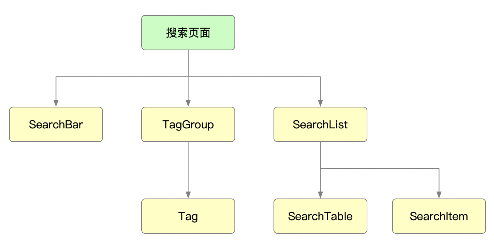
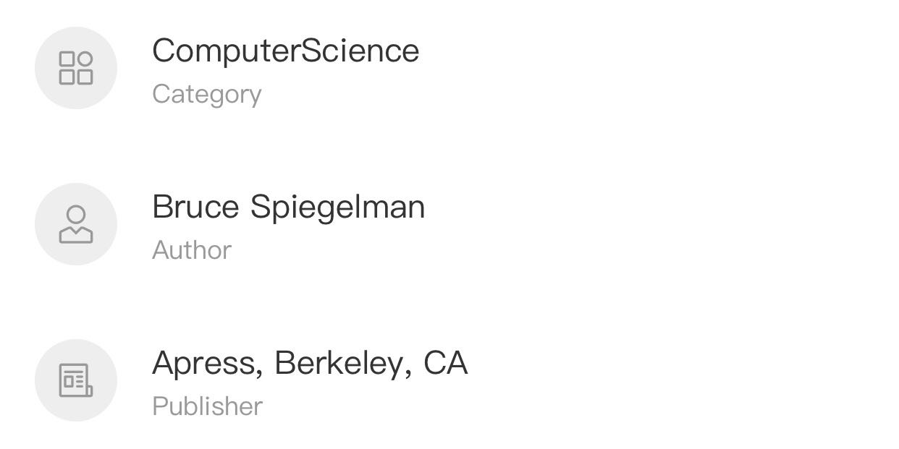

# 搜索开发

## 搜索视觉稿
[http://www.youbaobao.xyz/mpvue-design/preview/#artboard1](http://www.youbaobao.xyz/mpvue-design/preview/#artboard1)

## 搜索页面组件结构图

## 标签组件
可交互的标签组件

<table>
    <tr>
        <th>组件名称</th>
        <th>属性</th>
        <th>参数</th>
        <th>用途</th>
        <th>默认值</th>
    </tr>
    <tr>
        <td rowspan="2">Tag</td>
        <td>props</td>
        <td>text</td>
        <td>标签文本</td>
        <td>(空)</td>
    </tr>
    <tr>
        <td>methods</td>
        <td>onClick</td>
        <td>标签点击事件</td>
        <td>(空)</td>
    </tr>
</table>

## 标签分组组件
标签分组组件，包含一个标题和按钮，以及标签分组

<table>
    <tr>
        <th>组件名称</th>
        <th>属性</th>
        <th>参数</th>
        <th>用途</th>
        <th>默认值</th>
    </tr>
    <tr>
        <td rowspan="5">TagGroup</td>
        <td rowspan="3">props</td>
        <td>headerText</td>
        <td>标题文本</td>
        <td>(空)</td>
    </tr>
    <tr>
        <td>btnText</td>
        <td>按钮文本</td>
        <td>(空)</td>
    </tr>
    <tr>
        <td>value</td>
        <td>标签数据</td>
        <td>[]</td>
    </tr>
    <tr>
        <td rowspan="2">methods</td>
        <td>onTagClick</td>
        <td>标签点击事件</td>
        <td>(空)</td>
    </tr>
    <tr>
        <td>onBtnClick</td>
        <td>按钮点击事件</td>
        <td>(空)</td>
    </tr>
</table>

## 搜索分类组件
搜索列表中的分类组件

<table>
    <tr>
        <th>组件名称</th>
        <th>属性</th>
        <th>参数</th>
        <th>用途</th>
        <th>默认值</th>
    </tr>
    <tr>
        <td rowspan="4">SearchItem</td>
        <td rowspan="3">props</td>
        <td>title</td>
        <td>标题文本</td>
        <td>(空)</td>
    </tr>
    <tr>
        <td>subTitle</td>
        <td>副标题文本</td>
        <td>(空)</td>
    </tr>
    <tr>
        <td>icon</td>
        <td>图标类型</td>
        <td>(空)</td>
    </tr>
    <tr>
        <td>methods</td>
        <td>onClick</td>
        <td>分类点击事件</td>
        <td>(空)</td>
    </tr>
</table>

## 搜索列表组件
搜索结果列表组件

<table>
    <tr>
        <th>组件名称</th>
        <th>属性</th>
        <th>参数</th>
        <th>用途</th>
        <th>默认值</th>
    </tr>
    <tr>
        <td rowspan="2">SearchTable</td>
        <td>props</td>
        <td>data</td>
        <td>列表数据</td>
        <td>[]</td>
    </tr>
    <tr>
        <td>methods</td>
        <td>onClick</td>
        <td>图书点击事件</td>
        <td>(空)</td>
    </tr>
</table>

## 综合搜索列表组件
包含分类和列表的综合搜索列表

<table>
    <tr>
        <th>组件名称</th>
        <th>属性</th>
        <th>参数</th>
        <th>用途</th>
        <th>默认值</th>
    </tr>
    <tr>
        <td rowspan="2">SearchList</td>
        <td>props</td>
        <td>data</td>
        <td>列表数据</td>
        <td>{}</td>
    </tr>
    <tr>
        <td>methods</td>
        <td>showList</td>
        <td>展示分类点击后的列表</td>
        <td>(空)</td>
    </tr>
</table>
