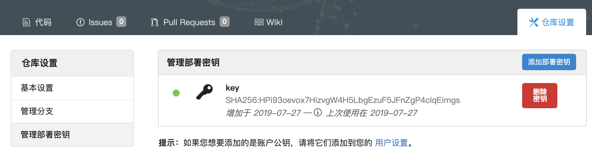

# git使用方法简介

## 创建仓库
选择免费的git平台创建仓库（如github、coding.net、码云等）
::: tip
建议空的代码仓库
:::

## 本地push源码
这里分两种情况：本地无源码和本地有源码
### 本地无源码
第一步，clone远程源码
```bash
git clone https://path/to/your/repository
```
第二步，编写源码，完成后上传源码
```bash
git add .
git commit -m "your commit message"
git push origin master --set-upstream
```
::: tip
注意初次提交时需要加上`--set-upstream`参数，因为远程不存在master分支，需要创建分支，第二次提交时就不需要了
:::

### 本地有源码
第一步，初始化git仓库
```bash
git init
```
第二步，添加远程仓库
```bash
git remote add origin https://path/to/your/repository
```
第三步，上传源码，与上一节方法相同

## 多git仓库源码管理
很多场景我们同一份源码需要在多个git仓库中进行投放，这时需要进行多仓库管理，首先我们查看本地远程仓库情况
```bash
git remote -v
origin	https://path/to/your/repository1 (fetch)
origin	https://path/to/your/repository1 (push)
```
添加远程仓库
```bash
git remote add upstream https://path/to/your/repository2
```
重新查看
```bash
git remote -v
origin	https://path/to/your/repository1 (fetch)
origin	https://path/to/your/repository1 (push)
origin	https://path/to/your/repository2 (fetch)
origin	https://path/to/your/repository2 (push)
```
向仓库1 master分支pull或push源码
```bash
git pull origin master # 等价于git pull
git push origin master # 等价于git push
```
向仓库2 master分支pull或push源码
```bash
git pull upstream master # master可以省略
git push upstream master # master可以省略
```

## 服务端pull源码
```bash
git clone https://path/to/your/repository
git pull
```

## git免密更新
在服务端pull源码时我们发现每次都需要输入git用户名和密码，这样更新非常麻烦，我们可以通过git免密更新解决，方法如下：
### 服务端生成密钥
在服务端输入如下指令
```bash
ssh-keygen -t rsa -C "youremail@example.com"
```
成功生成密钥后打印密钥信息
```bash
$ cat ~/.ssh/id_rsa.pub
ssh-rsa AAAAB3NzaC1yc2EAAAADAQABAAABAQCx/QMSjVSLKmHC0gNkVqjt59LdTkL1/3EJAQEIw
TtlFNqTGAjTQMdZByDEfYacTfrsjnabUfUXgXYLd4RHv1/HYWcDq/LQDqT7x8xEuyGnC8RX980/me
5O5DhadUT3q3plppHX2MaT/qhQPmBz9H/fUGpkcL8nLJS3xCgXh4psC4us3Wnc1XUr7u1AEPZmmWc
NVfehZ2cpr8DnD0MoWc2elKUQFmRuq3TyKnSvZRqPZ4OszmQ251mJEXcAZTUnHQQ1zszKSjO/oeY7
1XGOMOACqSCDBIw1cyMw5QTJ73vgxDOvMGMOntr/HuJbGmAevinl062/ph+47zNFRafTPm8r 9000
00000@qq.com
```

### 部署密钥
在git仓库中选择"仓库设置"->"管理部署密钥"（这里以慕课网的git仓库为例，其他仓库类似）


选择添加部署密钥，将服务端生成的密钥拷贝并添加

### 尝试免密更新
再次使用git pull发现不需要使用密码即可更新
