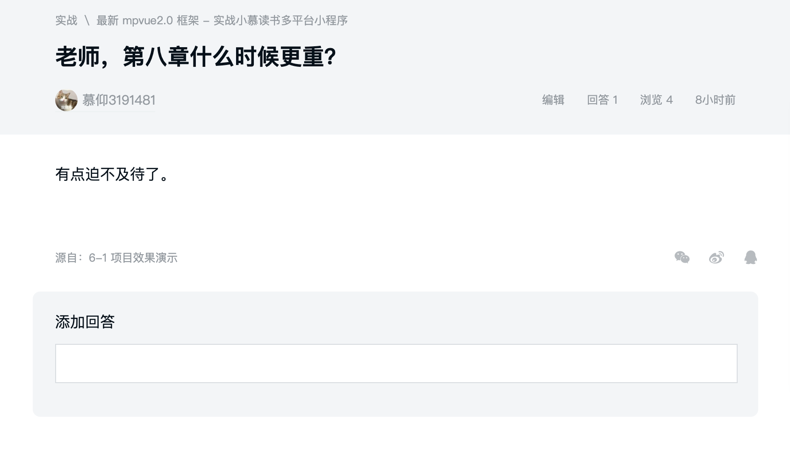
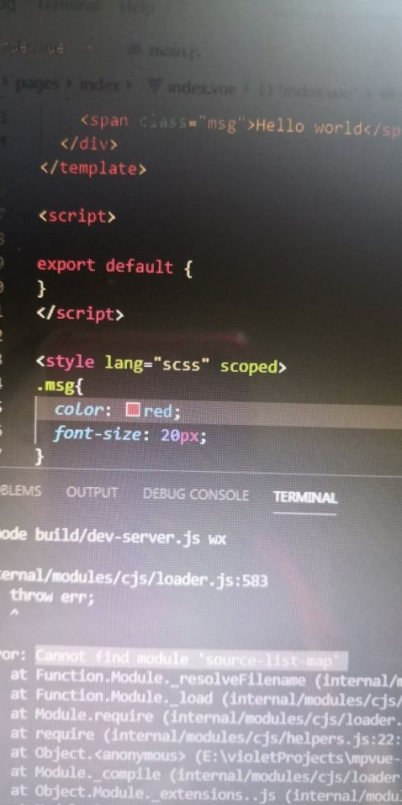
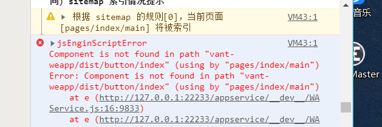

# 常见问题汇总

## 8月4日 

### 花絮
今天碰到一位非常可爱的同学，给大家报告一下，第8章已经录制完毕，正在后期剪辑中，第9章正在紧张制作中，谢谢大家的期待！


### 构建错误

#### 问题现象
今天问答区有同学出现`webpack`构建后运行失败的情况，具体报错如下：
```bash
vendor.js:17 Uncaught TypeError: __webpack_require__(...) is not a function
    at Object.<anonymous> (vendor.js:17)
    at __webpack_require__ (manifest.js:59)
    at Object._ (main.js:32)
    at __webpack_require__ (manifest.js:59)
    at Object.<anonymous> (vendor.js:6922)
    at __webpack_require__ (manifest.js:59)
    at Object.<anonymous> (vendor.js:6899)
    at __webpack_require__ (manifest.js:59)
    at Object.<anonymous> (vendor.js:6892)
    at __webpack_require__ (manifest.js:59)
```

#### 解决方法
解决方法出奇简单，只需要重启服务即可

::: tip
原文地址：[http://coding.imooc.com/learn/questiondetail/135053.html](http://coding.imooc.com/learn/questiondetail/135053.html)
:::

### 依赖安装问题

#### 问题现象
这位同学使用`npm`安装`node-sass`和`sass-loader`报错后，使用`cnpm`安装成功，但是运行项目后提示：
```bash
Cannot find module 'source-list-map'
```



#### 解决方法
这类问题通常由于国内`npm`网络不佳，导致依赖没有安装完全，删除`node_modules`重装依赖即可解决问题，国内推荐使用`cnpm`

::: tip
原文地址：[http://coding.imooc.com/learn/questiondetail/135120.html](http://coding.imooc.com/learn/questiondetail/135120.html)
:::

## 8月1日

### 小程序运行问题

#### 问题现象
为什么我的代码编译成功，却无法运行呢？报错如下：


#### 解决方法
这位同学犯了一个小小的错误，他通过微信开发者工具打开了代码目录（比如代码目录是：`D:\mpvue\mpvue-imooc-ebook`），而实际我们应该打开微信小程序代码所在目录，这个路径位于：`D:\mpvue\mpvue-imooc-ebook\dist\wx`，打开小程序代码目录后，问题迎刃而解

#### 反馈
今天通过TeamViewer远程解决了同学的问题，不算大问题，解决后得到同学的好评，非常开心^^这位同学也非常辛苦，晚上近11点还在学习！

